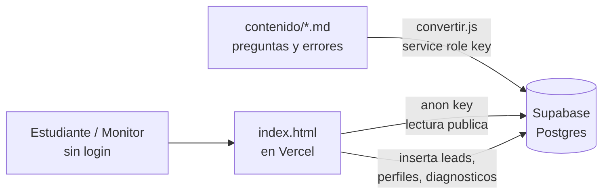

# Calibra — Plan de despliegue del MVP

**Fecha:** 2026-09-16 (actualizado el 21 de septiembre) · **Equipo:** Calibra (Lorenzo, Juan David Acevedo, Juan David Chávez, David)

## Estado al 21 de septiembre

Este documento nació como plan de despliegue el 16 de septiembre. Las secciones de abajo conservan ese plan, ya cumplido en su mayor parte; lo vigente es esto:

- **Base de datos:** el proyecto Supabase `uotlhaitdkfroavqkvee` existe, tiene datos (8 materias, contenido subido con `convertir.js --supabase`, diagnósticos ya guardados) y RLS activo. `supabase/schema.sql` define **13 tablas**; los cambios sobre una base viva van en `supabase/migraciones/` (001 a 004, todas aditivas). Nunca correr `schema.sql` sobre una base con datos: empieza con `drop table ... cascade`.
- **Agenda (migración 004):** `franjas` (horas concretas de cada monitor), `estudiantes` (uno por correo) y `citas` (la sesión: franja + monitor + estudiante + diagnóstico). Se reserva solo con la función `reservar_franja()`, que bloquea la franja de forma atómica; `citas.franja_id` es único, así que una hora no se puede reservar dos veces. Los monitores agregan franjas con `publicar_franjas()`. `sesion_id` sigue siendo el id del navegador, no una cita.
- **Backend:** una sola Edge Function, `supabase/functions/enviar-correo`, disparada por un webhook sobre `citas`. Manda la confirmación al estudiante y el brief al monitor. Necesita Resend.
- **Frontend:** `index.html` (unas 8.200 líneas) lee 9 tablas al arrancar, escribe en `leads`, `monitores` y `resultados_diagnostico`, y llama a `reservar_franja` y `publicar_franjas`. Sin credenciales o sin conexión sigue funcionando con los datos del archivo.
- **Contenido:** 8 materias activas con 12 preguntas cada una (Cálculo Integral tiene 51 con borradores). Los enunciados pueden llevar bloques de código con cercas ``` (ver `contenido/README.md`).
- **Ramas:** `main` es la de producción y la de por defecto. Falta publicar en Vercel.
- **Sigue sin haber:** autenticación, pagos reales y política de tratamiento de datos.
- **Verificación:** `verificar.cmd` hizo 522 comprobaciones el 21 de septiembre, antes del cambio de franjas. Ese cambio lo rompe en los campos de horario del perfil y falta ajustarlo.

## Qué es Calibra hoy

Calibra conecta estudiantes de pregrado de Uniandes con monitores de materias de ciclo básico. El diferenciador frente a directorios como Calico es una prueba de opción múltiple calibrada: cada opción incorrecta delata un error conceptual específico, así que el resultado le dice al estudiante en qué subtema falla y le entrega al monitor un brief de la sesión antes de empezar.

*(Descripción del 16 de septiembre.)* Todo el prototipo vivía en un único `index.html` (5036 líneas, HTML/CSS/JS sin frameworks ni build), sin backend, base de datos, autenticación ni pagos reales — decisión explícita del brief original, pensada para poder abrir el archivo con doble clic o publicarlo gratis en GitHub Pages/Netlify Drop. Hoy sigue siendo un solo `index.html` sin build, pero con Supabase detrás (ver arriba).

El contenido (materias, subtemas, preguntas y sus errores) no se edita en el HTML: vive en `contenido/*.md`, un archivo por materia, y un script Node (`contenido/convertir.js`) lo compila hacia dos arreglos de JavaScript (`MATERIAS`, `MONITORES`) que quedan escritos dentro del `index.html`. El 16 de septiembre había 3 materias activas con 36 preguntas y 3 sin contenido; hoy hay 8 activas con 12 preguntas cada una.

*(16 de septiembre.)* La captura de correo usaba una constante `FORM_ENDPOINT` vacía que solo simulaba el agradecimiento; hoy cada correo se guarda en `leads`. El arnés de verificación con Playwright (`verificar.cmd`) recorre ambos flujos a 390×844 (522 comprobaciones el 21 de septiembre).

El repositorio está en GitHub (`github.com/dvarela5101/Calibra`). *(16 de septiembre: todo estaba en la rama `juzouy` y no había `main`; hoy `main` existe y es la de producción.)*

## Decisiones de alcance para este MVP

El equipo decidió tres cosas antes de definir los pasos técnicos:

1. **Persistencia completa en Supabase.** Todo lo que hoy es hardcodeado o efímero pasa a vivir en una base de datos real: materias, subtemas, preguntas y sus errores, monitores, resultados de diagnóstico y los leads de correo.
2. **Sin autenticación por ahora.** No hay login de estudiante ni de monitor en esta iteración; los datos se guardan en Supabase pero cualquiera puede usar la app sin crear cuenta, igual que hoy.
3. **Vercel como hosting principal.** El frontend estático se despliega ahí (con GitHub Pages como opción de respaldo si el equipo quiere mantenerlo, ya que el profesor mencionó ambos).

Esta combinación es deliberadamente mínima: guarda datos reales para que el MVP deje de ser una demo de mentira, pero no agrega la complejidad de cuentas y sesiones, que puede esperar a una siguiente iteración.

## Arquitectura objetivo

Tres piezas, sin capa de backend propia:



El frontend sigue siendo un `index.html` estático, sin build ni framework: se le agrega el cliente `@supabase/supabase-js` por CDN y una llamada al arrancar que reemplaza los arreglos `MATERIAS`/`MONITORES` hardcodeados por datos leídos de Supabase con la llave pública (`anon key`), protegida por Row Level Security en vez de por estar oculta.

El pipeline de contenido (`contenido/*.md` → `convertir.js`) se mantiene porque ya funciona y es la forma en que cualquiera del equipo agrega preguntas sin programar; lo que cambia es el destino: en vez de escribir dentro del `index.html`, el script inserta o actualiza filas en Supabase usando la llave de servicio (`service_role`), que nunca se expone en el frontend.

Vercel solo sirve los archivos estáticos; no hace falta ninguna función serverless para este alcance porque no hay lógica que deba esconderse del cliente (sin pagos, sin auth).

## Esquema de datos propuesto en Supabase

*(Propuesta original de siete tablas; la vigente son 13, en `supabase/schema.sql`. Además de estas siete: `knowledge_components`, `misconcepciones` y `pregunta_kc` para el diagnóstico por habilidad, y `estudiantes`, `franjas` y `citas` para la agenda.)* Solo `monitores`, `resultados_diagnostico` y `leads` aceptan inserción pública —sin auth, cualquiera puede insertar en esas tres (ver riesgos más abajo). `franjas` y `citas` no se escriben directo: pasan por `publicar_franjas()` y `reservar_franja()`.

| Tabla | Columnas clave | Quién escribe |
| --- | --- | --- |
| `materias` | id, nombre, codigo, activa | convertir.js (service role) |
| `subtemas` | id, materia\_id, clave, nombre | convertir.js (service role) |
| `preguntas` | id, subtema\_id, numero, dificultad, enunciado | convertir.js (service role) |
| `opciones` | id, pregunta\_id, letra, texto, es\_correcta, error\_texto | convertir.js (service role) |
| `monitores` | id, nombre, carrera, semestre, nivel, calificacion, precio\_hora, materia\_certificada\_id, encaje\_texto, creado\_en | Frontend (anon, público) — pantalla "crear perfil de monitor" |
| `resultados_diagnostico` | id, materia\_id, subtema\_debil\_id, error\_detectado\_texto, respuestas (jsonb), creado\_en | Frontend (anon, público) — al terminar la prueba |
| `leads` | id, correo, rol (estudiante/monitor), materia\_interes, creado\_en | Frontend (anon, público) — reemplaza el `FORM_ENDPOINT` vacío |

Políticas de RLS sugeridas: `select` abierto en las cuatro tablas de contenido y en `monitores`; `insert` abierto solo en `monitores`, `resultados_diagnostico` y `leads`; ningún `update`/`delete` público en ninguna tabla, y ningún `select` público en `leads` para que un visitante no pueda listar los correos capturados.

## Plan paso a paso

*Estado al 21 de septiembre: los pasos 1 a 6 están hechos (rama `main`, proyecto Supabase, tablas con RLS, `convertir.js --supabase`, `index.html` conectado y los tres inserts). Faltan el 7 (Vercel) y volver a correr el arnés (paso 8).*

1. **Arreglar la rama de producción.** Crear `main` a partir de `juzouy` (o renombrar `juzouy` a `main` y ajustar el default branch en GitHub), para que Vercel despliegue el código correcto.
2. **Crear el proyecto en Supabase** (plan gratuito) y guardar en un lugar seguro del equipo la `Project URL`, la `anon public key` y la `service_role key` —esta última nunca va al repositorio ni al frontend.
3. **Crear las tablas** del esquema anterior con el editor SQL de Supabase, y activar Row Level Security con las políticas descritas.
4. **Adaptar `contenido/convertir.js`** para que, además de (o en vez de) escribir en `index.html`, haga `upsert` de materias, subtemas, preguntas y opciones en Supabase usando la `service_role key` desde una variable de entorno local, nunca hardcodeada en el script.
5. **Adaptar `index.html`**: agregar el script de `@supabase/supabase-js` por CDN, inicializar el cliente con la `Project URL` y la `anon key` (públicas por diseño), y sustituir las constantes `MATERIAS`/`MONITORES` por una carga asíncrona al arrancar la app, mostrando una pantalla de carga breve mientras llega la respuesta.
6. **Conectar los tres flujos de escritura**: la pantalla de captura de correo inserta en `leads` (reemplaza `FORM_ENDPOINT`), "crear perfil de monitor" inserta en `monitores`, y el fin de la prueba inserta en `resultados_diagnostico`.
7. **Importar el repo en Vercel**, framework preset "Other" (sin build, directorio raíz), apuntando a la rama `main`.
8. **Verificar con Playwright** (`verificar.cmd`) contra la app ya conectada a Supabase, actualizando el oráculo si hace falta, antes de dar por cerrada la entrega.

## Riesgos y pendientes conocidos

- **Sin autenticación, con inserción pública abierta**: cualquiera puede crear un perfil de monitor falso o mandar resultados de diagnóstico falsos, porque la `anon key` con `insert` abierto no distingue usuarios. Aceptable para esta iteración del MVP, pero vale la pena decirlo explícitamente en la entrega como limitación conocida, no como descuido.
- ~~**No hay rama `main` todavía**~~ Resuelto: `main` existe y es la de producción.
- ~~**Tres materias sin contenido**~~ Resuelto: las 8 materias están activas.
- **Límites del plan gratuito de Supabase**: 500 MB de base de datos y el proyecto se pausa tras una semana sin actividad —irrelevante para el volumen de un MVP de curso, pero vale la pena que alguien del equipo lo revise si el proyecto queda inactivo entre entregas.
- **El pipeline `contenido/*.md` → Supabase** necesita que alguien corra `convertir.js` con la `service_role key` cada vez que cambian las preguntas; si nadie automatiza eso con GitHub Actions, hay que acordarse de hacerlo a mano antes de cada entrega.

## Pendiente: pago con PSE desde la página (entrega futura)

Hoy el pago se acuerda por fuera de la app: la Edge Function `enviar-correo` arma el bloque "Cómo pagar" con lo que haya en la variable `CALIBRA_PAGO` (`supabase/functions/enviar-correo/index.ts:146`), y si nadie la llena, el correo sale con el marcador tal cual.

Un **link de pago** sí cabe hoy sin servidor y sin exponer ningún secreto: es una URL, y un `<a href>` dentro de `index.html` abre el checkout con PSE incluso en `file://`. Wompi y Bold los generan desde su panel, sin código. Lo que necesita servidor no es iniciar el cobro: es **verificar que se pagó**.

Cobrar dentro de la página sí necesita backend. Wompi exige `signature:integrity` = SHA256(referencia + monto en centavos + moneda + secreto de integridad), y su documentación pide calcularlo en el servidor. PayU firma con el ApiKey y Mercado Pago pide el access token para crear la preferencia. Nada de eso cabe en `index.html` sin publicar una llave.

Dos bloqueantes propios de este prototipo, antes que cualquier pasarela:

1. **El retorno de la pasarela es una recarga de página y la app no tiene dónde guardar la sesión.** `estado.sesionId` es un uuid en memoria y `localStorage` está prohibido por una regla que el arnés verifica sobre el fuente. Al volver del banco el `sesionId` es otro y se rompe el único hilo que ata el pago con el lead y con el diagnóstico. El único canal que sobrevive es el query string, y hoy el router es solo de hash: eso es rediseño del estado, no una Edge Function más.
2. **El arnés exige `localStorage.length === 0` en tiempo de ejecución.** Cualquier widget embebido de pasarela escribe en `localStorage` desde su propio script, así que si esto se hace, tiene que ser por redirección a checkout alojado, nunca con un SDK embebido.

Si se implementa: dos Edge Functions nuevas (`crear-pago` y `webhook-pago`) siguiendo el despliegue que ya documenta el README de `enviar-correo`, más las cabeceras CORS que esa función no emite hoy. Y una tabla `pagos` (monto, referencia, estado, `lead_id`, id de transacción) con RLS cerrada: sin SELECT ni INSERT público, solo la función con la llave secreta escribe ahí.

Requisitos antes de recibir plata: cuenta de comercio a nombre de alguien. Wompi acepta persona natural sin cámara de comercio, pero pide RUT activo y cuenta Bancolombia o Nequi con más de 30 días; revisa en 1 a 3 días hábiles y a persona natural le desembolsa por primera vez a los 30 días. Falta decidir quién queda como titular. Recibir plata también activa obligaciones de facturación electrónica o documento equivalente ante la DIAN.

Legal, lo más duro primero: el art. 51 de la Ley 1480, reglamentado por el Decreto 587 de 2016, cubre PSE expresamente —reversión del pago, obliga a informar el procedimiento y los canales, da 15 días hábiles a los participantes del proceso de pago y exige que proveedor y emisor estén domiciliados en Colombia. El art. 47 da derecho de retracto de 5 días hábiles en venta a distancia, con el límite del servicio ya ejecutado: hay que definir la política para una monitoría prepagada. El art. 50 pide precio total y resumen del pedido antes de aceptar, más la identidad del proveedor (nombre o razón social, NIT, dirección de notificación judicial, teléfono, correo), que hoy no está en ninguna parte de `index.html`. Nada de esto obliga a revelar la comisión, que se le cobra al monitor.

La política de tratamiento de datos **no** es un prerrequisito de PSE: es obligación de la Ley 1581 de 2012 y del Decreto 1377 de 2013 que ya se está incumpliendo hoy, porque la base guarda correos y teléfonos. Va en la entrega actual, no en esta.

## Próximos pasos inmediatos

Sugerido para repartir entre Lorenzo, Juan David Acevedo, Juan David Chávez y David —ajusten según quién ya conoce Supabase o Vercel:

- [ ] Arreglar la rama `main` y conectar el repo a Vercel — quien tenga acceso de administrador al repo de GitHub.
- [ ] Crear el proyecto Supabase, las tablas y las políticas de RLS — puede ir junto con quien adapte `convertir.js`, porque comparten el esquema.
- [ ] Adaptar `convertir.js` para escribir en Supabase en vez de (o además de) `index.html`.
- [ ] Adaptar `index.html` para leer `MATERIAS`/`MONITORES` desde Supabase y para los tres inserts (leads, monitores, resultados\_diagnostico).
- [ ] Correr `verificar.cmd` sobre la versión conectada a Supabase y confirmar que el flujo completo sigue funcionando de punta a punta.

Queda pendiente por confirmar cuánto de esto se hace antes del 23 de septiembre versus después; eso también decide cuánto se paraleliza entre las cuatro personas.
