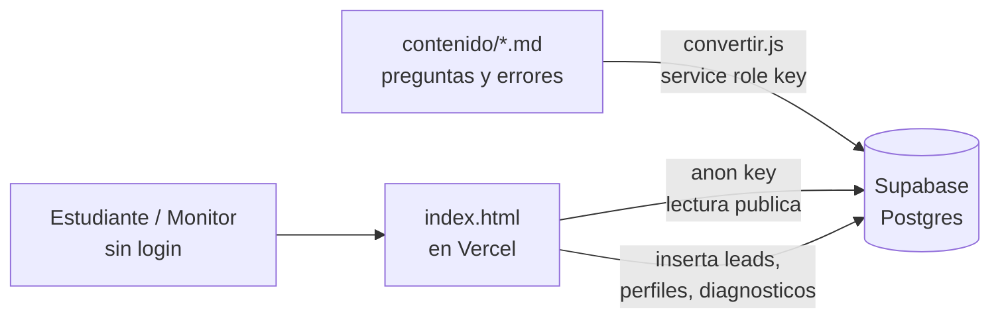

# Calibra — Plan de despliegue del MVP

**Fecha:** 2026-09-16 · **Equipo:** Calibra (Lorenzo, Juan David Acevedo, Juan David Chávez, David)

## Qué es Calibra hoy

Calibra conecta estudiantes de pregrado de Uniandes con monitores de materias de ciclo básico. El diferenciador frente a directorios como Calico es una prueba de opción múltiple calibrada: cada opción incorrecta delata un error conceptual específico, así que el resultado le dice al estudiante en qué subtema falla y le entrega al monitor un brief de la sesión antes de empezar.

Todo el prototipo vive hoy en un único `index.html` (5036 líneas, HTML/CSS/JS sin frameworks ni build). No hay backend, base de datos, autenticación ni pagos reales — fue una decisión explícita del brief original, pensada para poder abrir el archivo con doble clic o publicarlo gratis en GitHub Pages/Netlify Drop.

El contenido (materias, subtemas, preguntas y sus errores) no se edita en el HTML: vive en `contenido/*.md`, un archivo por materia, y un script Node (`contenido/convertir.js`) lo compila hacia dos arreglos de JavaScript (`MATERIAS`, `MONITORES`) que quedan escritos dentro del `index.html`. Hoy hay 3 materias activas con 36 preguntas (Cálculo Integral, Física II, Probabilidad y Estadística) y 3 más sin contenido (Álgebra Lineal, Cálculo Vectorial, Cálculo Diferencial).

La captura de correo usa una constante `FORM_ENDPOINT` vacia: si tuviera una URL de Formspree, enviaria el correo por `fetch`; vacia, solo simula el agradecimiento sin guardar nada. Un arnés de verificación con Playwright (`verificar.cmd`) recorre ambos flujos a 390×844; hoy pasa 174 de 195 chequeos (las 21 fallas son esperadas, por el cambio de 4 a 12 preguntas por materia).

El repositorio ya existe en GitHub (`github.com/dvarela5101/Calibra`), pero todo el trabajo —incluido lo usado en la presentación de hoy— está en la rama `juzouy`; no hay una rama `main`.

## Decisiones de alcance para este MVP

El equipo decidió tres cosas antes de definir los pasos técnicos:

1. **Persistencia completa en Supabase.** Todo lo que hoy es hardcodeado o efímero pasa a vivir en una base de datos real: materias, subtemas, preguntas y sus errores, monitores, resultados de diagnóstico y los leads de correo.
2. **Sin autenticación por ahora.** No hay login de estudiante ni de monitor en esta iteración; los datos se guardan en Supabase pero cualquiera puede usar la app sin crear cuenta, igual que hoy.
3. **Vercel como hosting principal.** El frontend estático se despliega ahí (con GitHub Pages como opción de respaldo si el equipo quiere mantenerlo, ya que el profesor mencionó ambos).

Esta combinación es deliberadamente mínima: guarda datos reales para que el MVP deje de ser una demo de mentira, pero no agrega la complejidad de cuentas y sesiones, que puede esperar a una siguiente iteración.

## Arquitectura objetivo

Tres piezas, sin capa de backend propia:

El frontend sigue siendo un `index.html` estático, sin build ni framework: se le agrega el cliente `@supabase/supabase-js` por CDN y una llamada al arrancar que reemplaza los arreglos `MATERIAS`/`MONITORES` hardcodeados por datos leídos de Supabase con la llave pública (`anon key`), protegida por Row Level Security en vez de por estar oculta.

El pipeline de contenido (`contenido/*.md` → `convertir.js`) se mantiene porque ya funciona y es la forma en que cualquiera del equipo agrega preguntas sin programar; lo que cambia es el destino: en vez de escribir dentro del `index.html`, el script inserta o actualiza filas en Supabase usando la llave de servicio (`service_role`), que nunca se expone en el frontend.

Vercel solo sirve los archivos estáticos; no hace falta ninguna función serverless para este alcance porque no hay lógica que deba esconderse del cliente (sin pagos, sin auth).

## Esquema de datos propuesto en Supabase

Siete tablas. Solo `monitores`, `resultados_diagnostico` y `leads` aceptan inserción pública —sin auth, cualquiera puede insertar en esas tres (ver riesgos más abajo).

| Tabla | Columnas clave | Quién escribe |
| --- | --- | --- |
| `materias` | id, nombre, codigo, activa | convertir.js (service role) |
| `subtemas` | id, materia\_id, clave, nombre | convertir.js (service role) |
| `preguntas` | id, subtema\_id, numero, dificultad, enunciado | convertir.js (service role) |
| `opciones` | id, pregunta\_id, letra, texto, es\_correcta, error\_texto | convertir.js (service role) |
| `monitores` | id, nombre, carrera, semestre, nivel, calificacion, precio\_hora, materia\_certificada\_id, encaje\_texto, creado\_en | Frontend (anon, público) — pantalla "crear perfil de monitor" |
| `resultados_diagnostico` | id, materia\_id, subtema\_debil\_id, error\_detectado\_texto, respuestas (jsonb), creado\_en | Frontend (anon, público) — al terminar la prueba |
| `leads` | id, correo, rol (estudiante/monitor), materia\_interes, creado\_en | Frontend (anon, público) — reemplaza el `FORM_ENDPOINT` vacío |

Políticas de RLS sugeridas: `select` abierto en las cuatro tablas de contenido y en `monitores`; `insert` abierto solo en `monitores`, `resultados_diagnostico` y `leads`; ningún `update`/`delete` público en ninguna tabla, y ningún `select` público en `leads` para que un visitante no pueda listar los correos capturados.

## Plan paso a paso

1. **Arreglar la rama de producción.** Crear `main` a partir de `juzouy` (o renombrar `juzouy` a `main` y ajustar el default branch en GitHub), para que Vercel despliegue el código correcto.
2. **Crear el proyecto en Supabase** (plan gratuito) y guardar en un lugar seguro del equipo la `Project URL`, la `anon public key` y la `service_role key` —esta última nunca va al repositorio ni al frontend.
3. **Crear las tablas** del esquema anterior con el editor SQL de Supabase, y activar Row Level Security con las políticas descritas.
4. **Adaptar `contenido/convertir.js`** para que, además de (o en vez de) escribir en `index.html`, haga `upsert` de materias, subtemas, preguntas y opciones en Supabase usando la `service_role key` desde una variable de entorno local, nunca hardcodeada en el script.
5. **Adaptar `index.html`**: agregar el script de `@supabase/supabase-js` por CDN, inicializar el cliente con la `Project URL` y la `anon key` (públicas por diseño), y sustituir las constantes `MATERIAS`/`MONITORES` por una carga asíncrona al arrancar la app, mostrando una pantalla de carga breve mientras llega la respuesta.
6. **Conectar los tres flujos de escritura**: la pantalla de captura de correo inserta en `leads` (reemplaza `FORM_ENDPOINT`), "crear perfil de monitor" inserta en `monitores`, y el fin de la prueba inserta en `resultados_diagnostico`.
7. **Importar el repo en Vercel**, framework preset "Other" (sin build, directorio raíz), apuntando a la rama `main`.
8. **Verificar con Playwright** (`verificar.cmd`) contra la app ya conectada a Supabase, actualizando el oráculo si hace falta, antes de dar por cerrada la entrega.

## Riesgos y pendientes conocidos

- **Sin autenticación, con inserción pública abierta**: cualquiera puede crear un perfil de monitor falso o mandar resultados de diagnóstico falsos, porque la `anon key` con `insert` abierto no distingue usuarios. Aceptable para esta iteración del MVP, pero vale la pena decirlo explícitamente en la entrega como limitación conocida, no como descuido.
- **No hay rama `main` todavía**: todo el trabajo, incluido el de la presentación de hoy, está en `juzouy`. Hay que resolver esto antes de conectar el despliegue automático.
- **Tres materias sin contenido** (Álgebra Lineal, Cálculo Vectorial, Cálculo Diferencial): no bloquea el despliegue, pero si la entrega espera más materias activas, es trabajo de contenido, no de infraestructura.
- **Límites del plan gratuito de Supabase**: 500 MB de base de datos y el proyecto se pausa tras una semana sin actividad —irrelevante para el volumen de un MVP de curso, pero vale la pena que alguien del equipo lo revise si el proyecto queda inactivo entre entregas.
- **El pipeline `contenido/*.md` → Supabase** necesita que alguien corra `convertir.js` con la `service_role key` cada vez que cambian las preguntas; si nadie automatiza eso con GitHub Actions, hay que acordarse de hacerlo a mano antes de cada entrega.

## Próximos pasos inmediatos

Sugerido para repartir entre Lorenzo, Juan David Acevedo, Juan David Chávez y David —ajusten según quién ya conoce Supabase o Vercel:

- [ ] Arreglar la rama `main` y conectar el repo a Vercel — quien tenga acceso de administrador al repo de GitHub.
- [ ] Crear el proyecto Supabase, las tablas y las políticas de RLS — puede ir junto con quien adapte `convertir.js`, porque comparten el esquema.
- [ ] Adaptar `convertir.js` para escribir en Supabase en vez de (o además de) `index.html`.
- [ ] Adaptar `index.html` para leer `MATERIAS`/`MONITORES` desde Supabase y para los tres inserts (leads, monitores, resultados\_diagnostico).
- [ ] Correr `verificar.cmd` sobre la versión conectada a Supabase y confirmar que el flujo completo sigue funcionando de punta a punta.

Queda pendiente por confirmar cuánto de esto se hace antes del 23 de septiembre versus después; eso también decide cuánto se paraleliza entre las cuatro personas.
